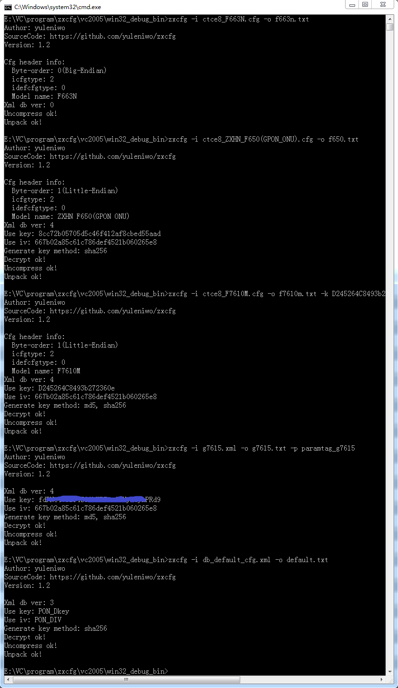
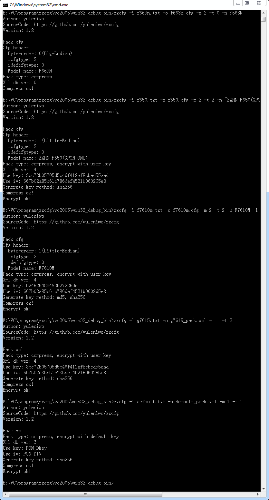

# zxcfg
ZTE CFG file and XML file unpacking and packaging tool.

<pre><code>
Usage: zxcfg [OPTIONS]
Options:
  -i  input file name
  -o  output file name
  -m  mode
      0 --- unpack cfg or xml file (default mode)
      1 --- pack into xml file
      2 --- pack into cfg file
      3 --- unpack hardcode file(/etc/hardcodefile/)
  -t  pack type (pack mode only)
      0 --- compress
      1 --- compress, encrypt with default key
      2 --- compress, encrypt with user key
  -k  aescbc encrypt & decrypt key
  -v  aescbc encrypt & decrypt iv
  -g  generate aescbc key method
      0 --- sha256(default, if the "-k" option is not specified)
      1 --- md5, sha256(default, if the "-k" option is specified)
  -n  device model name.(only used to pack into cfg. default: ZXHN F7015TV3)
  -l  byte order.(only used to pack into cfg. default: 0)
      0 --- big endian
      1 --- little endian
  -c  cfg type (only used to pack into cfg. default: 2)
  -d  defcfg type (only used to pack into cfg. default: 0)
  -p  specify the paramtag file(Used only to unpack files)
  -h  show this help message

Unpacking example:
  zxcfg -i ctce8_F663N.cfg -o f663n.txt
  zxcfg -i ctce8_ZXHN_F650(GPON_ONU).cfg -o f650.txt
  zxcfg -i ctce8_F7610M.cfg -o f7610m.txt -k D245264C8493b272360e
  zxcfg -i g7615.xml -o g7615.txt -p paramtag_g7615
  zxcfg -i db_default_cfg.xml -o default.txt

Packing example:
  zxcfg -i f663n.txt -o f663n.cfg -m 2 -t 0 -n F663N
  zxcfg -i f650.txt -o f650.cfg -m 2 -t 2 -n "ZXHN F650(GPON ONU)" -l 1
  zxcfg -i f7610m.txt -o f7610m.cfg -m 2 -t 2 -n F7610M -l 1 -k D245264C8493b272360e
  zxcfg -i g7615.txt -o g7615_pack.xml -m 1 -t 2
  zxcfg -i default.txt -o default_pack.xml -m 1 -t 1
</code></pre>

### Unpacking example image

### Packing example image
